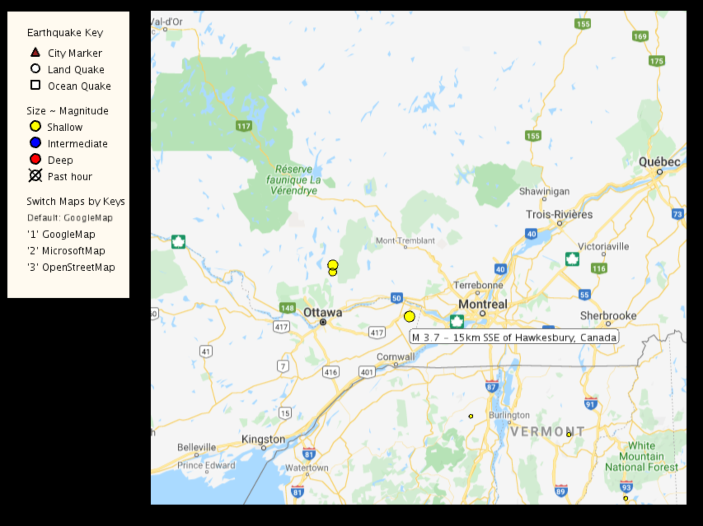
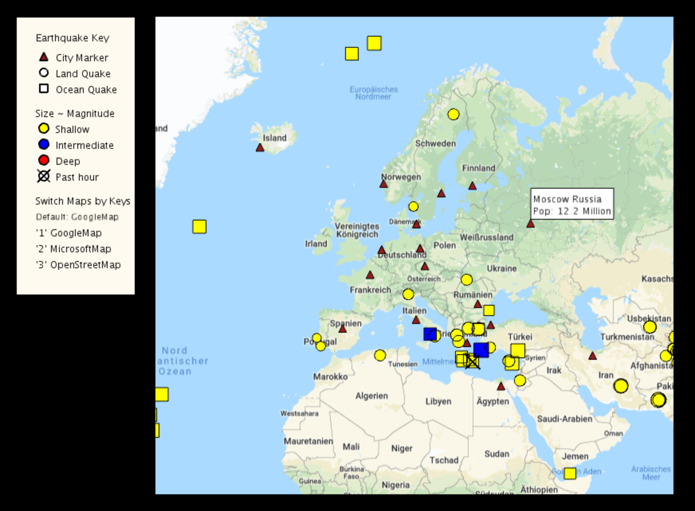

# Interactive Earthquake Map of the World 
## Description:
- Built an Applet of a 2D earthquake map of the world using Processing (Java) graphics methods and Unfolding Maps library functions to visualize earthquake data

- Collected recent earthquake and city data from live RSS feeds and plotted corresponding land quake, oceanic quake, and city markers on the map depending on parsed properties with a key besides the map

- Constructed markers with different shapes and colors according to their magnitude, category, depth and time

- Created abstract classes and interfaces to organize all marker classes for class hierarchy and polymorphism

- Built event handlers to interactively respond to mouse input to hide and show city markers affected by an earthquake or all the earthquakes that can threat the clicked city, to keyboard input to switch among three map providers

---
## Image Presentation
### - Map Interface

### - Earthquake Marker

### - City Marker
